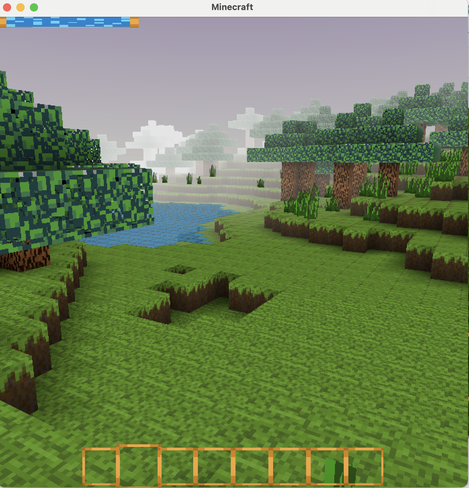

# Voxel 3d physics engine 

A voxel 3d physics engine. Inspired by the game 'Teardown'. I plan to make a fantasy open-world voxel game with destructible physics.  

Uses OpenGL 3.3 and SDL for platform layer.

## Goals
### Physics
- [ ] Make collision check use continous collision detection.
- [ ] Reduce number of 'corner' voxels to check. I'm not sure how to prioritize which voxels to choose. But right now a voxel sphere has 604 corner checks, which seems like a lot. 
- [ ] Break apart shapes when you click on them. Use some sort of fracturing algorithm, and flood fill to decide if need to create a seperate physics body. 

### Environment
- [ ] Convert my minecraft chunk code to use 0.1metre size for voxels instead of 1metre. 
- [ ] Add shadow maps. 
    
## WHY's
- [x] Fun & Challenging to program
- [x] Want to make a game
- [x] Build confidence

 

## Building on Mac OS
run ```./run.sh``` to build and run the program. 

